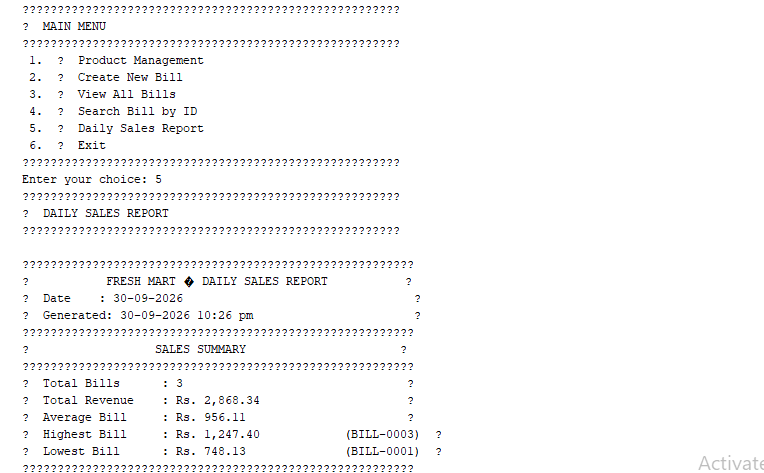
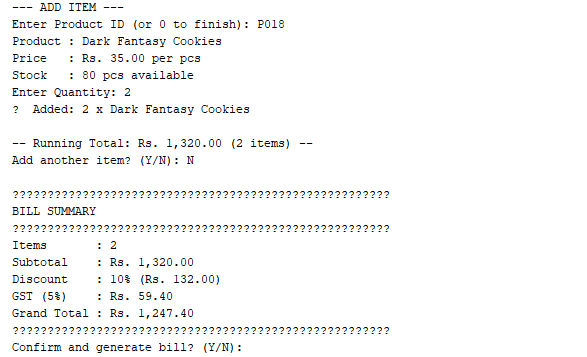
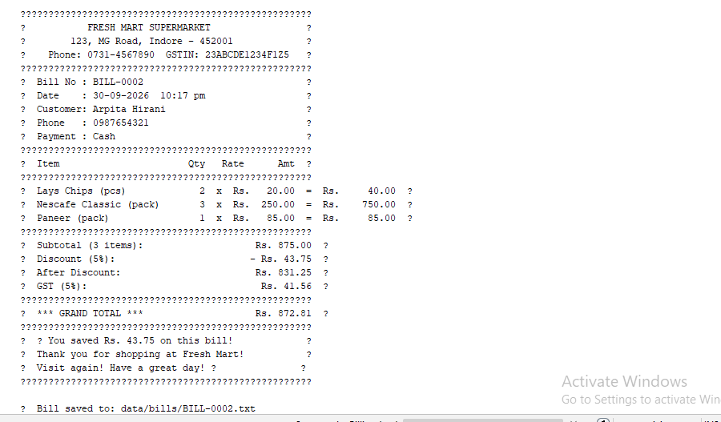

The project follows a layered structure separating data models, business logic (services), and console/file utilities, so that each class has a single, focused responsibility.

How It Works: 
  	1.	On startup, the application checks for required data folders/files and creates them if missing, seeding default sample products on first run.
	  2.	The user is shown a main menu with options to manage products, create a bill, view/search bills, generate a daily report, or exit.
	  3.	Product management lets the user add, search, update, delete, or restock inventory items, with changes saved to file immediately.
	  4.	Billing lets the user select products and quantities to build a bill; the system calculates the subtotal, applies the appropriate discount tier, adds   GST, and generates a formatted receipt, which is saved to its own file and logged in a bill index.
	  5.	Past bills can be listed (with total revenue) or looked up individually by Bill ID.
	  6.	A daily sales report can be generated and saved to file.

Requirements
	•	JDK 21
	•	Apache NetBeans (or any Java IDE / command-line javac and java)

How to Run

Using Apache NetBeans
	1.	Clone or download this repository.
	2.	Open NetBeans → File → Open Project → select the Supermarket Billing project folder.
	3.	Right-click the project in the Projects panel → Run.
	4.	Interact with the application through the built-in NetBeans Output console.

Data Storage

This project does not use a database. All data is stored locally as plain text files, created automatically on first run inside a data/ folder:

File	Purpose

data/products.txt	Pipe-delimited product records

data/bill_index.txt	One-line summary of every bill created

data/bill_counter.txt	Tracks the last used bill number for ID generation

data/bills/BILL-XXXX.txt	Full formatted receipt for each individual bill

Data is read back into memory each time the application starts, so information persists between runs without requiring any external database setup.

Screenshots

### Main Menu

### Bill Generation

### Daily Report

-->

Future Improvements

The following are potential enhancements and are not currently implemented:
	•	Migrating data storage from text files to a relational database (e.g., MySQL via JDBC)
	•	Adding a graphical user interface (Swing or JavaFX)
	•	Adding user authentication/login for staff access
	•	Expanding reporting with category-wise or date-range sales analytics
	•	Exporting bills/reports as PDF

Author

Arpita Hirani
GitHub: arpitas231055-dotcom
